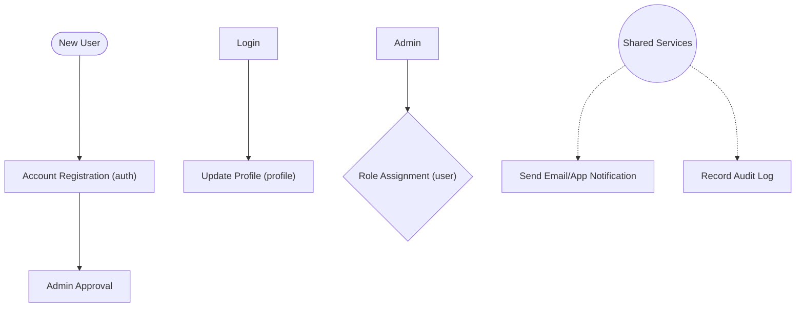
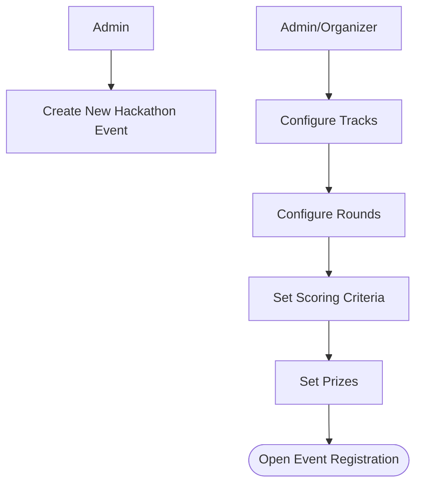
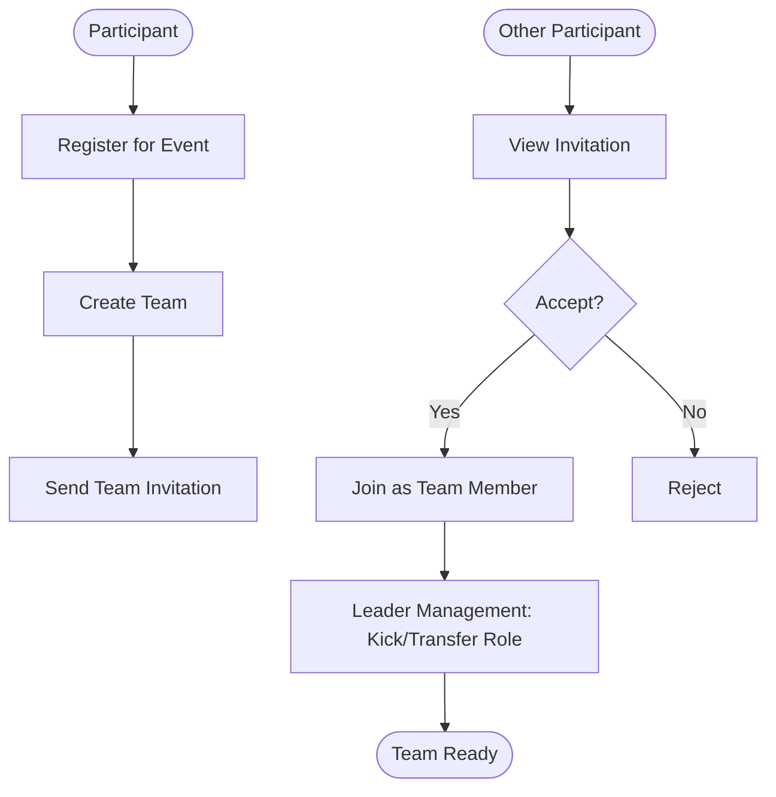
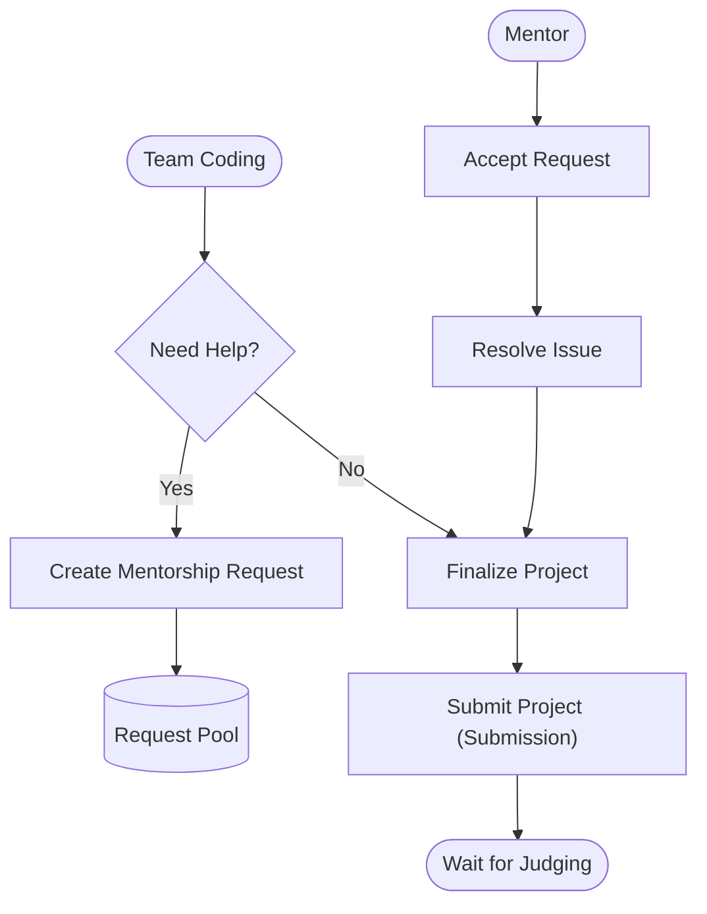
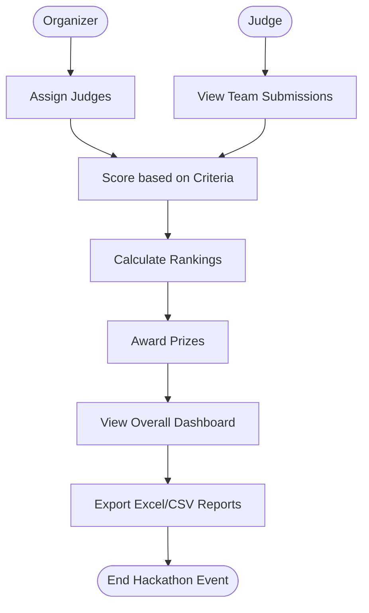

# 🦭 SEAL Hackathon Management System
> **A full-stack, comprehensive platform designed to organize, manage, and scale hackathon events seamlessly.**
SEAL Hackathon Management System handles everything from participant registration and team formation to mentor matchmaking, judge scoring, and dynamic round advancements. Built with modern web technologies, it provides a robust and scalable solution for hackathon organizers, participants, mentors, and judges.
***
## ✨ Key Features
- **🔐 Role-Based Access Control**: Secure login, routing, and specialized dashboards tailored for Admins, Organizers, Judges, Mentors, and Participants.
- **👥 Team Management & Invitations**: Seamlessly create teams, invite members, and manage team profiles and submissions.
- **🤝 Mentorship System**: Request mentors based on specific technical expertise and facilitate automatic or manual matching for guidance.
- **⚖️ Judge Assignment & Multi-Criteria Scoring**: Assign judges to specific tracks or teams, and evaluate projects across customizable scoring criteria.
- **🏆 Dynamic Leaderboard & Round Advancements**: Real-time tracking of scores, automatic rankings, and dynamic advancement of teams to subsequent hackathon rounds.
- **🔔 Real-Time Notifications & Emails**: Stay updated with Server-Sent Events (SSE) and integrated email alerts for important milestones, invitations, and announcements.
***
## 🧩 Business Flows (Backend Architecture)
### 1. Core System & Account Management (Foundation)
**Assigned to:** Nguyễn Quang Huy
**Modules:** `auth`, `user`, `profile`, `audit_log`, `notification`, `debug`
This flow serves as the backbone of the system. It handles user identity and provides shared services (notifications, logging).

### 2. Event Initialization & Management
**Assigned to:** Nguyễn Khôi Nguyên
**Modules:** `hackathon_event`, `track`, `round`, `criterion`, `prize`
This flow is designed for Admins/Organizers to configure the "rules" and event structure before opening registration to participants.

### 3. Registration & Team Formation (Participants)
**Assigned to:** Nguyễn Lê Anh Tú
**Modules:** `event_registration`, `team`, `team_invitation`, `team_member`
This flow outlines the participant's journey from event registration to finding teammates and finalizing the team roster.

### 4. Competition & Mentorship (Hackathon Execution)
**Assigned to:** Võ Thanh Tuấn
**Modules:** `submission`, `mentorship_request`
This flow occurs in real-time during the event. Teams develop their projects, request mentor assistance when stuck, and submit their final work.

### 5. Judging, Ranking & Reporting
**Assigned to:** Trương Ngọc Bảo
**Modules:** `judge_assignment`, `score`, `ranking`, `dashboard`, `export`
The final flow to conclude the hackathon. It covers the evaluation of submissions, announcing results, and generating reports.

***
## 🛠️ Tech Stack
### Backend


### Frontend


### Database

***
## ⚙️ Local Setup / Installation Instructions
### Prerequisites
- Java 17 (or higher)
- Node.js (v18+)
- MySQL Server
### 1. Database Setup
Start your MySQL server and create a database named `seal_hackathon`:
```sql
CREATE DATABASE seal_hackathon;
```
### 2. Backend Setup
Clone the repository and navigate to the backend directory:
```bash
git clone https://github.com/tuan3011/SEAL-Hackathon-Management.git
cd SEAL-Hackathon-Management/backend
```
*Note: Update `src/main/resources/application.properties` with your MySQL credentials, Google OAuth2 client credentials (replace `MOCK_ID` and `MOCK_SECRET`), and JWT secret before running.*
Build and run the Spring Boot application using Maven:
```bash
./mvnw spring-boot:run
```
*The backend server will typically start on `http://localhost:8080`.*
### 3. Frontend Setup
Open a new terminal and navigate to the frontend directory:
```bash
cd SEAL-Hackathon-Management/frontend
```
Install the dependencies:
```bash
npm install
```
Create a `.env` file in the frontend root and configure your backend API URL:
```env
VITE_API_URL=http://localhost:8080/api
```
Start the Vite development server:
```bash
npm run dev
```
*The frontend will typically be accessible at `http://localhost:5173`.*
***
## 📖 API Documentation
This project uses **Swagger UI** for comprehensive API documentation and manual endpoint testing.
Once the backend server is running, you can view and interact with the RESTful APIs by navigating to:
**[`http://localhost:8080/swagger-ui.html`](http://localhost:8080/swagger-ui.html)**
***
## 🤝 Contributors
Contributions, issues, and feature requests are welcome!
- **Võ Thanh Tuấn** - *Competition & Mentorship Flow* - [tuan3011](https://github.com/tuan3011)
- **Nguyễn Khôi Nguyên** - *Event Initialization & Management Flow* - [NguyenNK27](https://github.com/NguyenNK27)
- **Nguyễn Lê Anh Tú** - *Registration & Team Formation Flow* - [nguyentu-2505](https://github.com/nguyentu-2505)
- **Nguyễn Quang Huy** - *Core System & Account Management Flow* - [qh-uy](https://github.com/qh-uy)
- **Trương Ngọc Bảo** - *Judging, Ranking & Reporting Flow* - [BaoTNSE203313](https://github.com/BaoTNSE203313)
***
*Made with ❤️ by the SEAL Team.*
