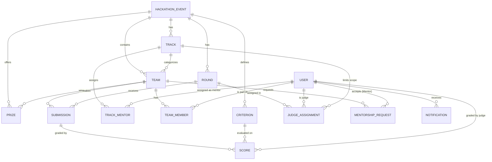

# DATABASE RELATIONSHIP DIAGRAM (Sơ Đồ Luồng Hoàn Chỉnh)

Sơ đồ mô phỏng kiến trúc tổng quát của Hackathon System bao gồm cả Chấm điểm (Scoring), Giải thưởng (Prize) và Giao việc Giám khảo (Judge Assignment).

## Chú giải Business Flow (Toàn vẹn Dữ liệu)
1. **Scoring Flow:** Một `Score` bắt buộc phải khóa với `Submission` của thí sinh, `Criterion` do Ban Tổ Chức quy định, và `User` mang Role `JUDGE`. Giám khảo chỉ được chấm bài nếu họ có bản ghi trong bảng `JudgeAssignment`.
2. **Mentorship Flow:** Mentor phụ thuộc qua bảng `TrackMentor`.
3. **Prize/Ranking:** Được trao cho `Team` dựa trên tổng điểm (`Score` * `Criterion.weight`). Bảng `Prize` liên kết trực tiếp với Team chiến thắng.
