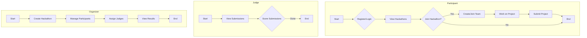

```mermaid
graph TD
    subgraph "Participant"
        A[Start] --> B{Register/Login};
        B --> C[View Hackathons];
        C --> D{Join Hackathon?};
        D -- Yes --> E[Create/Join Team];
        E --> F[Work on Project];
        F --> G[Submit Project];
        G --> H[End];
        D -- No --> H;
    end

    subgraph "Judge"
        I[Start] --> J[View Submissions];
        J --> K{Score Submissions};
        K -- Done --> L[End];
    end

    subgraph "Organizer"
        M[Start] --> N[Create Hackathon];
        N --> O[Manage Participants];
        O --> P[Assign Judges];
        P --> Q[View Results];
        Q --> R[End];
    end
```
