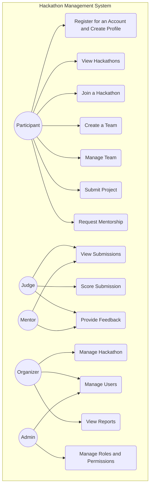

```mermaid
graph TD
    subgraph "Hackathon Management System"
        participant((Participant))
        judge((Judge))
        mentor((Mentor))
        organizer((Organizer))
        admin((Admin))

        uc_register_profile(Register for an Account and Create Profile)
        uc_view_hackathons(View Hackathons)
        uc_join_hackathon(Join a Hackathon)
        uc_create_team(Create a Team)
        uc_manage_team(Manage Team)
        uc_submit_project(Submit Project)
        uc_request_mentorship(Request Mentorship)
        uc_view_submissions(View Submissions)
        uc_score_submission(Score Submission)
        uc_provide_feedback(Provide Feedback)
        uc_manage_hackathon(Manage Hackathon)
        uc_manage_users(Manage Users)
        uc_manage_roles(Manage Roles and Permissions)
        uc_view_reports(View Reports)
    end

    participant --> uc_register_profile
    participant --> uc_view_hackathons
    participant --> uc_join_hackathon
    participant --> uc_create_team
    participant --> uc_manage_team
    participant --> uc_submit_project
    participant --> uc_request_mentorship

    judge --> uc_view_submissions
    judge --> uc_score_submission
    judge --> uc_provide_feedback

    mentor --> uc_view_submissions
    mentor --> uc_provide_feedback

    organizer --> uc_manage_hackathon
    organizer --> uc_manage_users
    organizer --> uc_view_reports

    admin --> uc_manage_roles
    admin --> uc_manage_users
```
